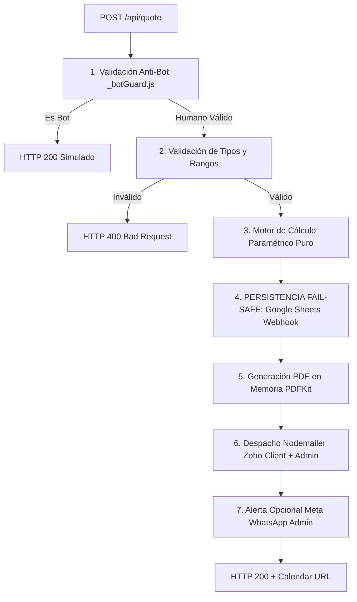

# Implementation Plan: 001 - Core Quote Engine
**Feature ID:** `001_core_quote_engine`  
**Estado:** PENDING APPROVAL  
**Foco:** Refactorización, estabilización sintáctica, persistencia y pruebas reales sin mocks ciegos.

---

## 1. Diagnóstico del Problema y Justificación
`api/quote.js` es el núcleo transaccional del sitio web. Actualmente presenta dos defectos bloqueantes:
1. **Error de Sintaxis (Línea 125):** `isAmpliacion` está declarado dos veces en el mismo ámbito con `const`.
2. **Error de Sintaxis (Línea 322):** Un operador ternario roto duplica condiciones tras un punto y coma.
3. **Persistencia Ausente:** Si el servidor SMTP de Zoho tiene una interrupción o latencia >10s (timeout de Vercel), el prospecto no se guarda en ningún lado y el cliente recibe error 500.

---

## 2. Arquitectura de la Solución



### 2.1. Modularización Interna de `api/quote.js`
Para posibilitar pruebas unitarias reales sin tener que levantar un servidor SMTP o conectarse a Vercel, el archivo se estructurará con funciones puras desacopladas:

1. `calculateQuote(params)`:
   - Función pura e isomórfica.
   - Recibe: `{ tipo, sistema, area, pisos, terminaciones, comuna, permisos }`.
   - Devuelve: `{ baseUFm2, multiplicador, factorComuna, factorPermisos, costoM2Final, totalEstimado, minUF, maxUF, permisosData, comunaHuman }`.
   - Exportada para permitir que la suite de pruebas unitarias compruebe el 100% de las ramas de cálculo sin simular HTTP.
2. `persistLeadToGoogleSheets(leadData)`:
   - Conexión vía `fetch` asíncrono con timeout de 3.5 segundos hacia `process.env.GOOGLE_SHEETS_WEBHOOK_URL`.
   - Si no está configurada la URL o falla la conexión, registra error en log y continúa el flujo de ejecución (Fail-Safe), evitando bloquear al usuario.
3. `generateQuotePDF(leadData, quoteData)`:
   - Genera el buffer con `pdfkit` conteniendo branding institucional y botón hacia Cal.com.
4. `sendNotificationEmails(transporter, leadData, quoteData, pdfBuffer)`:
   - Despacha los correos a cliente y administrador.
5. Handler Serverless `module.exports = async (req, res)`:
   - Orquesta la secuencia con manejo de errores limpio y CORS estricto.

---

## 3. Estrategia de Persistencia (Google Sheets Webhook)

### 3.1. Esquema de Columnas en Google Sheets
El payload que se enviará al Webhook de Google Sheets contendrá los siguientes campos normalizados:
```json
{
  "timestamp": "2026-09-08T15:30:00.000Z",
  "fecha_hora_chile": "08/09/2026, 12:30:00",
  "nombre": "Juan Pérez",
  "email": "juan@ejemplo.com",
  "telefono": "+56912345678",
  "tipo_obra": "Casa Nueva",
  "sistema_constructivo": "Metalcon",
  "superficie_m2": 120,
  "pisos": 1,
  "terminaciones": "Estandar",
  "comuna": "Las Condes",
  "estado_dom": "Permiso de Edificación DOM Aprobado",
  "rango_uf_estimado": "2.189 a 2.394 UF",
  "total_estimado_uf": 2280,
  "origen": "Web Cotizador Cuatropuntas",
  "estado_lead": "NUEVO_SIN_CONTACTAR"
}
```

---

## 4. Estrategia de Pruebas Reales (Sin Mocks Ciegos)

Para cumplir con el **Principio III de la Constitución**, eliminaremos los mocks ciegos de la suite de pruebas:

### 4.1. Suite Unitaria: `tests/quote-engine.spec.js`
Pruebas directas con el motor de pruebas de Playwright / Node:
1. **Prueba de Carga de Módulo:**
   `require('../api/quote')` debe cargarse en Node sin lanzar SyntaxError ni ReferenceError.
2. **Pruebas de la Matriz de Precios:**
   - Caso 1: Casa Nueva Metalcom 100 m² (1 piso, estándar, comuna central) → `totalEstimado` exacto a 19 UF/m² * 100 = 1.900 UF.
   - Caso 2: Baño Pequeño 4 m² en Remodelación → Aplica piso técnico de 60-70 UF referenciales en lugar de multiplicar 4 * 11 UF/m² (evitando presupuestos absurdos de 44 UF).
   - Caso 3: Cocina 12 m² → Aplica piso técnico de 85-98 UF referenciales.
   - Caso 4: Descuento por Permiso DOM Aprobado (factor 0.94).
   - Caso 5: Recargo por Terminaciones Premium (+10%).
3. **Pruebas de Casos Límite y Validaciones:**
   - Área < 3 m² o > 5000 m² → Debe arrojar rechazo.
   - Pisos < 1 o > 4 → Debe arrojar rechazo.
   - Nombres fraudulentos de bot → `_botGuard` lo detecta.

### 4.2. Suite de Integración E2E: `tests/verify.spec.js`
- Se mantendrá la validación visual en navegador, pero la llamada de prueba al cotizador en UI verificará que el backend responde con los tipos y campos esperados en lugar de limitarse a interceptar con `route.fulfill`.

---

## 5. Plan de Contingencia y Rollback
- Si durante el despliegue en Vercel surge alguna incompatibilidad en el entorno serverless, se mantendrá un respaldo versionado del archivo previo para revertir con un solo commit limpio.
- El servidor local `local-dev-server.js` se actualizará para montar `/api/quote` y permitir pruebas locales antes de subir a GitHub.
