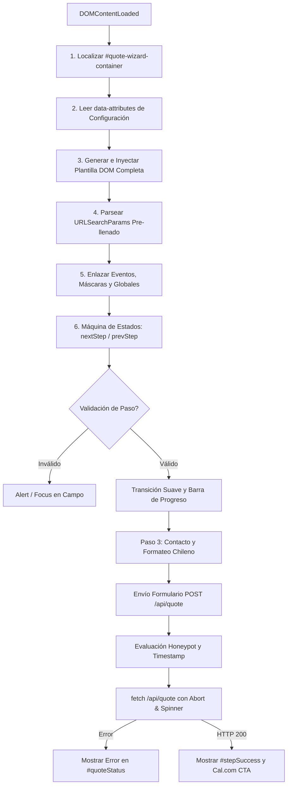

# Implementation Plan: 002 - Modular Quote Wizard
**Feature ID:** `002_modular_quote_wizard`  
**Estado:** PENDING APPROVAL  
**Foco:** Desacoplamiento DRY del Frontend, Estandarización de UX y Normalización de Canales.

---

## 1. Diagnóstico del Problema y Justificación
Actualmente, el formulario multi-paso del cotizador se encuentra copiado y pegado de manera íntegra en **7 archivos HTML**:
1. `public/index.html` (~310 líneas de HTML/JS)
2. `public/precios.html` (~310 líneas de HTML/JS)
3. `public/subsidio-minvu-sitio-propio.html` (~310 líneas de HTML/JS)
4. `public/servicios/casas-nuevas.html` (~310 líneas de HTML/JS)
5. `public/servicios/segundos-pisos.html` (~310 líneas de HTML/JS)
6. `public/servicios/quinchos.html` (~310 líneas de HTML/JS)
7. `public/servicios/remodelaciones.html` (~310 líneas de HTML/JS)

### Consecuencias Técnicas:
- **Deuda Técnica Crítica:** Más de 1.800 líneas de código duplicado. Cualquier cambio en las comunas, campos o textos de éxito requiere editar manualmente los 7 archivos.
- **Inconsistencias de Experiencia:** En algunos archivos se manejan validaciones distintas, no hay normalización uniforme del formato de WhatsApp ni soporte para pre-llenado desde campañas o funnels de WhatsApp.
- **Residuo de Canales Obsoletos:** `public/index.html` aún conserva en su bloque WebMCP (`modelContext.registerTool`) el número de pruebas purgado `56963482439` y tarifas desactualizadas (`13.5 UF` vs matriz real `19 UF`). `public/auth.md` también conserva `56963482439`.

---

## 2. Arquitectura del Componente Modular (`public/quote-wizard.js`)



### 2.1. Contrato Estricto del DOM (Retrocompatibilidad 100%)
Para evitar romper los estilos Tailwind existentes y las pruebas E2E en Playwright, `public/quote-wizard.js` inyectará exactamente la misma estructura de identificadores y clases:

| Elemento / Identificador | Rol en el DOM | Requisito de Compatibilidad |
| :--- | :--- | :--- |
| `#quoteForm` | Formulario raíz | Evento `submit` interceptado con `preventDefault()` |
| `#step1`, `#step2`, `#step3` | Contenedores de paso | Clases `.step-container`, `.hidden`, `.opacity-0` |
| `#progressBar` | Barra de progreso visual | Estilos dinámicos `width: 33%`, `66%`, `100%` |
| `#stepIndicatorProg` / `#stepIndicatorTitle` | Textos de progreso | Textos sincronizados por paso |
| `#qTipo`, `#qSistema`, `#qArea` | Inputs del Paso 1 | Selectores poblados según `data-tipos` y `data-sistemas` |
| `#website_url`, `#_hp_check` | Honeypot anti-bots | Ocultos vía inline CSS `left: -9999px` |
| `#qPisos`, `#qTerminaciones`, `#qComuna`, `#qPermisos` | Inputs del Paso 2 | Lista completa de las 52 comunas de la RM |
| `#qNombre`, `#qEmail`, `#qTelefono` | Inputs del Paso 3 | Máscara de validación chilena `+56 9 ...` |
| `#quoteSubmitBtn`, `#quoteStatus` | Botón y mensaje de estado | Deshabilitación durante envío, texto de error rojo |
| `#stepSuccess` | Pantalla de confirmación | Despliegue tras HTTP 200 |
| `#calendarCTAContainer`, `#calendarBtnLink` | Bloque Cal.com | Visibilidad condicionada a `data.calendarUrl` |
| `#fallbackCTAContainer` | Bloque contacto manual | Despliegue si no se entrega `calendarUrl` |

### 2.2. Configuración Flexible vía Data Attributes
Cada página podrá personalizar las opciones iniciales del cotizador sin alterar la lógica central:
```html
<div id="quote-wizard-container"
     data-default-tipo="Casa Nueva"
     data-default-sistema="Metalcon"
     data-tipos="Casa Nueva,Ampliacion,Remodelacion,Quincho"
     data-sistemas="Metalcon,SIP,Albanileria,Mixto"
     data-placeholder-area="Ej: 50">
</div>
<noscript>
    <div class="p-4 bg-orange-50 border border-secondary text-center text-sm text-gray-700 rounded-lg">
        Para cotizar en línea por favor habilita JavaScript o escríbenos directamente a 
        <a href="https://wa.me/56927384075" class="text-secondary font-bold underline">WhatsApp (+56 9 2738 4075)</a>.
    </div>
</noscript>
<script src="/quote-wizard.js" onerror="this.onerror=null;this.src='../quote-wizard.js';" defer></script>
```

### 2.3. Funciones Globales Exportadas en `window`
Para mantener compatibilidad con enlaces en tablas de precios y scripts de la página:
- `window.nextStep(step)`: Avanza o retrocede al paso indicado ejecutando las validaciones correspondientes.
- `window.prevStep(step)`: Retrocede sin re-validar.
- `window.calcularCon(tipo, sistema)`: Establece los valores en el cotizador, reinicia al Paso 1 y efectúa `scrollIntoView` suave hacia `#contacto`.
- `window.QuoteWizard`: Objeto que expone métodos de utilidad (`init`, `reset`, `setValues`, `validatePhone`).

### 2.4. Algoritmo de Normalización Telefónica Chilena
El asistente implementará una rutina robusta de formateo:
1. Limpieza de caracteres no numéricos (manteniendo `+` inicial si existe).
2. Si el número inicia con `569` o `9` con 9 dígitos móviles (`9XXXXXXXX`), se formatea para presentación como `+56 9 XXXX XXXX`.
3. Al enviar al backend, se asegura que el campo contenga entre 8 y 12 dígitos, evitando números truncados o letras accidentales.

### 2.5. Soporte Isomórfico para Protocolos `http://` y `file:///`
Para compatibilidad con la suite de pruebas local de Playwright que ejecuta pruebas sobre URLs `file:///.../public/*.html`:
- En páginas raíz (`index.html`, `precios.html`, `subsidio-minvu-sitio-propio.html`): el script se carga vía `./quote-wizard.js`.
- En subpáginas (`servicios/*.html`): el script utiliza fallback automático:
  `<script src="/quote-wizard.js" onerror="this.onerror=null;this.src='../quote-wizard.js';" defer></script>`
Esto garantiza funcionamiento nativo en producción Vercel y éxito 100% garantizado en pruebas locales sin requerir servidores mock.

---

## 3. Higiene de Canales y WebMCP
1. **Actualización de WebMCP en `public/index.html`:**
   - Reemplazar `contacto_whatsapp: "https://wa.me/56963482439"` por `"https://wa.me/56927384075"`.
   - Alinear tarifas del tool `cotizar_construccion` a la matriz oficial:
     `precios: { metalcom: 19, sip: 21, albanileria: 25 }`.
2. **Actualización en `public/auth.md`:**
   - Reemplazar `https://wa.me/56963482439` por `https://wa.me/56927384075`.

---

## 4. Estrategia de Pruebas (Test Plan)

### 4.1. Nueva Suite de Pruebas: `tests/quote-wizard.spec.js`
Se creará una suite completa que valide:
1. **Renderizado Correcto del Componente:** Comprueba la presencia de todos los IDs del contrato en `index.html` y en `servicios/casas-nuevas.html`.
2. **Validación de Pasos:**
   - Intentar avanzar de Paso 1 sin m² genera bloqueo y foco en `#qArea`.
   - Área < 3 m² bloquea el avance.
   - Avanzar a Paso 2 y luego a Paso 3 valida todos los selectores.
3. **Pre-llenado de Parámetros URL:** Cargar `index.html?nombre=Ignacio&telefono=912345678&tipo=Quincho` comprueba que los campos correspondientes se inicien poblados y el teléfono formateado.
4. **Interacción con Botón `calcularCon`:** Simular clic en botón "Calcular con Metalcom" en `precios.html` y verificar que el wizard se actualice a `Casa Nueva` + `Metalcon` en Paso 1.
5. **Manejo de Errores en Envíos:** Simular fallo 500 en `/api/quote` y validar que `#quoteSubmitBtn` vuelva a quedar habilitado con texto restaurado y `#quoteStatus` muestre el mensaje de error.
6. **Manejo de Éxito y Cal.com:** Simular respuesta 200 con `calendarUrl` y confirmar visualización de `#stepSuccess` y `#calendarCTAContainer`.

### 4.2. Pruebas de Regresión Existentes
Ejecutar `npx playwright test` sobre los 31 tests existentes para certificar que `tests/verify.spec.js` y `tests/quote-engine.spec.js` continúen en verde al 100%.
