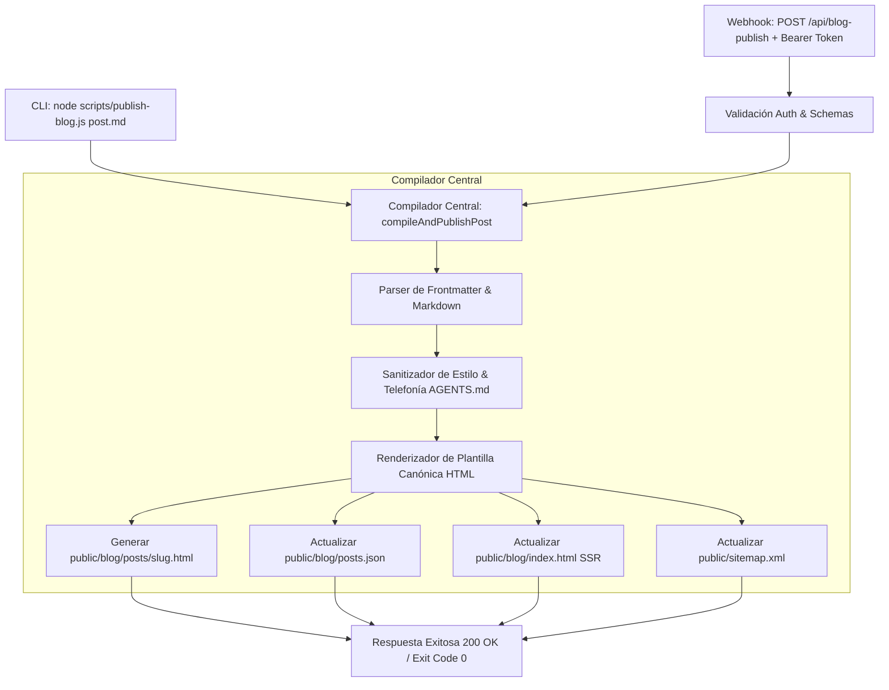

# Plan Técnico de Implementación: 003 - Pipeline y Motor Automatizado de Publicación del Blog
**Feature ID:** `003_blog_automation_engine`  
**Estado:** DRAFT / PROPUESTA  
**Única Fuente de Verdad:** `specs/003_blog_automation_engine/spec.md`, `AGENTS.md`

---

## 1. Arquitectura del Pipeline de Contenidos

El pipeline se diseña bajo un principio de desacoplamiento e idempotencia: la lógica central de parseo, generación de HTML y sincronización de índices residirá en un módulo compilador central reutilizable (`scripts/publish-blog.js`), el cual podrá ser consumido tanto por la línea de comandos (CLI) como por la función serverless de Vercel (`api/blog-publish.js`).

---

## 2. Componentes Técnicos

### 2.1. Módulo Compilador (`scripts/publish-blog.js`)
- **Parser de Frontmatter:** Extrae metadatos en formato YAML delimitados por `---`:
  - `title` (string, obligatorio)
  - `slug` (string, obligatorio, normalizado a kebab-case)
  - `excerpt` (string, obligatorio)
  - `category` (string, default: "Guías Prácticas")
  - `date` (string YYYY-MM-DD, default: fecha actual)
  - `author` (string, default: "Equipo Técnico Cuatropuntas")
  - `image` (string, default: imagen referencial del servicio correspondiente)
  - `readTime` (string, autocalculado si omitido: `Math.ceil(palabras / 200) + ' min de lectura'`)
  - `tags` (array de strings)
  - `faq` (array de objetos `{ question, answer }` o objeto `{ q, a }`)
- **Parser Liviano de Markdown a HTML:**
  - Encabezados: `## Titulo` &rarr; `<h2 class="text-2xl font-bold text-primary border-l-4 border-secondary pl-4 mb-4 mt-8">...</h2>`
  - Encabezados: `### Subtitulo` &rarr; `<h3 class="text-xl font-bold text-primary mb-3 mt-6">...</h3>`
  - Párrafos: párrafos estándar con interlineado y tipografía consistente.
  - Listas: `*` o `-` &rarr; `<ul class="list-disc pl-6 space-y-2 text-gray-700">`, `1.` &rarr; `<ol class="list-decimal pl-6 space-y-2 text-gray-700">`.
  - Cajas destacadas / Advertencias: `> [!NOTE]` o `> Nota:` &rarr; `
...
`.
  - Tablas: sintaxis GFM `| col | col |` &rarr; `
<table class="w-full text-left text-sm border-collapse"><thead class="bg-primary text-white">...`.
- **Plantilla Canónica HTML:**
  - Extraída de la auditoría de los 7 artículos existentes en `public/blog/posts/`.
  - Incluye metadatos completos (OpenGraph, Twitter, Favicons, Tailwind CDN con paleta oficial `#1a202c`, `#c05621`, `#dd6b20`).
  - Genera Schema.org JSON-LD dual: nodo `TechArticle` / `Article` y nodo `FAQPage` (cuando existan FAQs).
  - Incluye Banner CTA de conversión con enlace ancla a `/#cotizador` y botón hacia la agenda oficial en Cal.com (`https://cal.com/cuatropuntas.com/visita-tecnica`).
  - Incluye botón flotante de WhatsApp oficial (`+56 9 2738 4075`).
- **Sincronización de Archivos Satélite:**
  - `posts.json`: inserta o actualiza el registro al inicio del array.
  - `index.html`: sincroniza la tarjeta estática en `#postsGrid` manteniendo la integridad del DOM para crawlers que no ejecutan JS.
  - `sitemap.xml`: agrega el nodo `<url>` con `priority: 0.8` y `changefreq: weekly` sin duplicaciones.

---

### 2.2. Webhook / Endpoint Serverless (`api/blog-publish.js`)
- **Contrato HTTP:**
  - Ruta: `POST /api/blog-publish`
  - Headers requeridos:
    - `Authorization: Bearer <process.env.BLOG_PUBLISH_SECRET>`
    - `Content-Type: application/json`
  - Formatos de Body aceptados:
    1. **Payload Markdown Puro:** `{ "markdown": "---\ntitle: ...\n---\nContenido..." }`
    2. **Payload JSON Estructurado:** `{ "title": "...", "slug": "...", "content": "...", "excerpt": "...", ... }`
- **Seguridad:**
  - Comparación de tokens con mitigación de ataques de tiempo (`crypto.timingSafeEqual` si longitudes coinciden).
  - Si `BLOG_PUBLISH_SECRET` no está configurado en entorno productivo, rechaza con 500 para evitar publicaciones no autenticadas por omisión.

---

### 2.3. Suite de Pruebas (`tests/blog-automation.spec.js`)
- **T01 (TDD Red Phase):** Comprobar que las pruebas iniciales fallen antes de implementar el compilador y el endpoint.
- **T02:** Compilación unitaria desde Markdown con frontmatter &rarr; genera HTML válido con Schema.org y metadatos.
- **T03:** Sincronización correcta de `posts.json`, `index.html` y `sitemap.xml`.
- **T04:** Verificación del endpoint HTTP (401 sin token, 400 datos incompletos, 200 éxito).
- **T05:** Verificación de higiene estricta según `AGENTS.md` (0 menciones a teléfonos obsoletos, presencia del enlace oficial Cal.com y botón WhatsApp).
