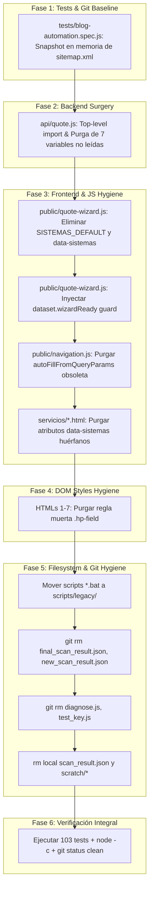

# Plan Técnico de Arquitectura: Spec 017 - Purga de Código Muerto, Deuda Técnica e Higiene del Repositorio
**Feature ID:** `017_repo_cleanup_and_tech_debt`  
**Estado:** COMPLETED  

---

## 1. Estrategia de Purga y Fases de Implementación

Para cumplir con el principio de *Modificaciones Quirúrgicas* y garantizar cero regresiones sobre los 103 tests existentes, la ejecución se dividirá en 5 fases secuenciales:



---

## 2. Detalle Técnico por Componente

### 2.1. Componente 1: Aislamiento de `public/sitemap.xml` en Tests
* **Archivo intervenido:** `tests/blog-automation.spec.js`
* **Mecanismo actual:** `T01.4` compila un post ficticio que inyecta un nodo `<url>` vía `publish-blog.js`. El helper `cleanupTestPost()` remueve el nodo con una expresión regular que altera el byte final previo a `</urlset>`.
* **Refactor propuesto:**
  ```javascript
  let originalSitemapContent = null;

  test.beforeAll(async () => {
      if (fs.existsSync(sitemapPath)) {
          originalSitemapContent = fs.readFileSync(sitemapPath, 'utf8');
      }
      cleanupTestPost();
  });

  test.afterAll(async () => {
      cleanupTestPost();
      if (originalSitemapContent !== null && fs.existsSync(sitemapPath)) {
          fs.writeFileSync(sitemapPath, originalSitemapContent, 'utf8');
      }
  });
  ```
* **Impacto:** Restaura el archivo original byte a byte en `afterAll`, neutralizando cualquier cambio de formato o saltos de línea LF/CRLF.

---

### 2.2. Componente 2: Saneamiento Backend `api/quote.js`
* **Archivo intervenido:** `api/quote.js`
* **Cambio 1 (Top-Level Require):**
  ```javascript
  // Líneas 1-3
  const nodemailer = require('nodemailer');
  const PDFDocument = require('pdfkit');
  const { isBotSubmission } = require('./_botGuard');
  ```
  Eliminar la invocación redundante `require('./_botGuard')` dentro de `quoteHandler`.
* **Cambio 2 (Purga de Desestructuración):**
  En `quoteHandler`, sustituir:
  ```javascript
  // ANTES (Líneas 379-395): 7 variables huérfanas
  const {
      baseUFm2, multiplicador, factorComuna, factorPermisos, costoM2Final,
      totalEstimado, minUF_raw, maxUF_raw, minUF, maxUF, permisosData,
      comunaHuman, isHumedoPuro, tipoHumedo, notasAlcance
  } = quote;

  // DESPUÉS: Únicamente las variables consumidas
  const {
      totalEstimado,
      minUF,
      maxUF,
      permisosData,
      comunaHuman,
      isHumedoPuro,
      tipoHumedo,
      notasAlcance
  } = quote;
  ```
* **Garantía:** `calculateQuote` continuará retornando todas las propiedades para preservar sus tests unitarios intactos en `tests/quote-engine.spec.js`.

---

### 2.3. Componente 3: Saneamiento Frontend `quote-wizard.js` y `navigation.js`
* **Archivos intervenidos:**
  - `public/quote-wizard.js`
  - `public/navigation.js`
  - `public/servicios/remodelaciones.html`
  - `public/servicios/quinchos.html`
* **Acciones en `public/quote-wizard.js`:**
  1. Eliminar `const SISTEMAS_DEFAULT = [...]` (Líneas 25-30).
  2. En `initQuoteWizard()`:
     - Eliminar líneas 710-713 (`const sistemasAttr = container.getAttribute('data-sistemas'); ...`).
     - Agregar guarda de idempotencia en `initQuoteWizard`:
       ```javascript
       const quoteForm = document.getElementById('quoteForm');
       if (quoteForm) {
           if (quoteForm.dataset.wizardReady === 'true') return;
           quoteForm.dataset.wizardReady = 'true';
           _renderedAt = Date.now();
           // ...
       ```
* **Acciones en `public/navigation.js`:**
  - Purgar la función `autoFillFromQueryParams()` (Líneas 60-93) y su escuchador en `DOMContentLoaded`.
* **Acciones en HTMLs de Servicios:**
  - Purgar `data-sistemas="Metalcon,Albanileria"` del contenedor `#quote-wizard-container` en `servicios/remodelaciones.html:421` y `servicios/quinchos.html:367`.

---

### 2.4. Componente 4: Higiene CSS DOM (`.hp-field`)
* **Archivos intervenidos (7 páginas HTML):**
  - `public/index.html` (Línea ~201)
  - `public/precios.html` (Línea ~105)
  - `public/subsidio-minvu-sitio-propio.html` (Línea ~122)
  - `public/servicios/casas-nuevas.html` (Línea ~126)
  - `public/servicios/segundos-pisos.html` (Línea ~124)
  - `public/servicios/remodelaciones.html` (Línea ~123)
  - `public/servicios/quinchos.html` (Línea ~123)
* **Acción:** Retirar el bloque CSS no referenciado:
  ```css
  .hp-field {
      display: none !important;
      visibility: hidden;
      pointer-events: none;
  }
  ```

---

### 2.5. Componente 5: Higiene de Archivos y Árbol Git
* **Acciones de archivo y Git:**
  1. Crear carpeta `scripts/legacy/` si no existe.
  2. Mover con `git mv`:
     - `arreglar_logo.bat` -> `scripts/legacy/arreglar_logo.bat`
     - `configurar_identidad.bat` -> `scripts/legacy/configurar_identidad.bat`
     - `importar_logo.bat` -> `scripts/legacy/importar_logo.bat`
     - `organizar_archivos.bat` -> `scripts/legacy/organizar_archivos.bat`
     - `subir_a_github.bat` -> `scripts/legacy/subir_a_github.bat`
  3. Ejecutar `git rm` para volcados y diagnósticos en raíz:
     - `git rm final_scan_result.json`
     - `git rm new_scan_result.json`
     - `git rm diagnose.js`
     - `git rm test_key.js`
  4. Eliminar residuos locales:
     - `scan_result.json`
     - Contenidos huérfanos de `scratch/` (`lighthouse_result.json`, `verify.spec.js`, `verify_site.js`)

---

## 3. Matriz de No-Regresión y Verificación

| ID Verificación | Alcance | Comando de Ejecución | Criterio de Éxito |
| :--- | :--- | :--- | :--- |
| **V01** | Aislamiento Sitemap | `npx playwright test tests/blog-automation.spec.js` | 7/7 passed & `git status` limpio en `sitemap.xml` |
| **V02** | Sintaxis Backend | `node -c api/quote.js` | Exit code 0 |
| **V03** | Sintaxis Frontend | `node -c public/quote-wizard.js` | Exit code 0 |
| **V04** | Sintaxis Navigation | `node -c public/navigation.js` | Exit code 0 |
| **V05** | Wizard Polimórfico | `npx playwright test tests/polymorphic-wizard.spec.js` | 6/6 passed |
| **V06** | Wizard Modular | `npx playwright test tests/quote-wizard.spec.js` | 8/8 passed |
| **V07** | Motor Cotizador | `npx playwright test tests/quote-engine.spec.js` | 6/6 passed |
| **V08** | Suite Global Completa | `npx playwright test` | **103/103 tests passed (100% éxito)** |
| **V09** | Estado Git Limpio | `git status` | Sin archivos sin seguimiento ni diffs residuales |
