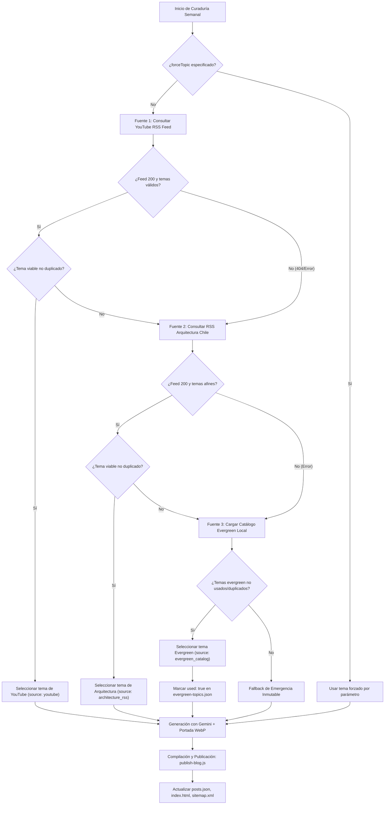

# Plan Técnico de Implementación: Spec 019 - Motor de Curaduría Multi-Fuente y Respaldo Evergreen para el Blog

**Feature ID:** `019_blog_multi_source_curator`  
**Estado:** PROPOSED  

---

## 1. Arquitectura de Curaduría en Cascada



---

## 2. Definición de Esquemas y Contratos de Datos

### 2.1. Esquema del Catálogo Evergreen (`content/evergreen-topics.json`)

```json
[
  {
    "id": "eg-01",
    "title": "Radier vs Sobrecimiento: Cuándo usar hormigón H-20 y cómo evitar fisuras por retracción en Santiago",
    "category": "Materiales & Sistemas",
    "service": "Casas Nuevas",
    "keywords": ["radier", "hormigon", "h-20", "sobrecimiento", "fundaciones"],
    "intent": "tecnico_comparativo",
    "used": false,
    "lastUsedDate": null
  },
  {
    "id": "eg-02",
    "title": "Sobreelevación Estructural Liviana en Metalcom: Cómo calcular la carga sobre losas existentes sin dañar el primer piso",
    "category": "Segundos Pisos & Ampliaciones",
    "service": "Ampliacion",
    "keywords": ["metalcom", "sobreelevacion", "segundo piso", "calculo estructural", "losa"],
    "intent": "seguridad_ingenieril",
    "used": false,
    "lastUsedDate": null
  }
]
```

### 2.2. Esquema Normalizado de Salida del Curador (`TopicObject`)

```typescript
interface CuratedTopic {
  title: string;
  category: string;
  keywords?: string[];
  source: 'youtube' | 'architecture_rss' | 'evergreen_catalog' | 'manual_override' | 'emergency_fallback';
  url?: string;
  originalDescription?: string;
  evergreenId?: string;
}
```

---

## 3. Módulos y Componentes a Modificar / Crear

### 3.1. `content/evergreen-topics.json` [NUEVO]
- Colección de al menos 25 temas de alta conversión distribuidos entre:
  * 6 temas de Casas Nuevas (Metalcom, SIP, Albañilería, Radier, Recepción DOM).
  * 6 temas de Segundos Pisos / Ampliaciones (Sobreelevación, Cargas, Regularización Ley del Mono, DOM).
  * 5 temas de Remodelaciones (Recintos húmedos, Cocinas, Baños, Redes Sanitarias, Partidas cerradas).
  * 5 temas de Quinchos y Terrazas (Cobertizos, Parcela vs Ciudad, Normativa DOM m² techados, Asadores en obra).
  * 3 temas de Eficiencia Térmica y Normativa General (Zona 3 RM, OGUC 4.1.10, Art. 18 LGUC).

### 3.2. `scripts/auto-curate-and-publish.js` [MODIFICAR]
- Añadir función `fetchArchitectureRssFeed(url, timeoutMs)` para consultar feeds RSS con timeout y fallback.
- Añadir función `extractArchitectureTopics(xmlContent)` para parsear feeds de arquitectura chilena (Plataforma Arquitectura / Madera21).
- Añadir función `loadEvergreenCatalog(catalogPath)` para leer `content/evergreen-topics.json` y filtrar los no usados.
- Añadir función `markEvergreenTopicAsUsed(catalogPath, topicId)` para persistir el consumo del tema en disco.
- Refactorizar `selectNextTopicMultiSource()` para ejecutar la cascada jerárquica con deduplicación rigurosa.
- Mantener retrocompatibilidad exacta: `selectNextTopic()` mantiene su firma anterior como proxy hacia `selectNextTopicMultiSource()`.

### 3.3. `tests/multi-source-curation.spec.js` [NUEVO]
- Suite TDD que prueba:
  1. `loadEvergreenCatalog()` carga $\ge 25$ temas válidos con keys requeridas.
  2. Cascada nivel 1: Si YouTube tiene temas viables, selecciona YouTube.
  3. Cascada nivel 2: Si YouTube falla (404 o duplicado), pero RSS de arquitectura tiene temas, selecciona RSS de arquitectura.
  4. Cascada nivel 3: Si YouTube y RSS fallan o devuelven duplicados, selecciona deterministamente el primer tema no usado de Evergreen.
  5. Deduplicación semántica: descarta temas que coincidan en título o palabras clave con `posts.json`.
  6. Actualización de estado en `evergreen-topics.json` (`used: true`).

---

## 4. Estrategia de Verificación y Criterios de Éxito

1. `npx playwright test tests/multi-source-curation.spec.js` pasa al 100% en verde.
2. `npx playwright test tests/blog-automation.spec.js tests/blog-image-generation.spec.js` se mantienen en verde.
3. Suite global de 109 tests se mantiene en verde (sin regresiones).
4. `node scripts/auto-curate-and-publish.js --dry-run` ejecuta el flujo completo de curaduría multi-fuente en terminal sin errores.
