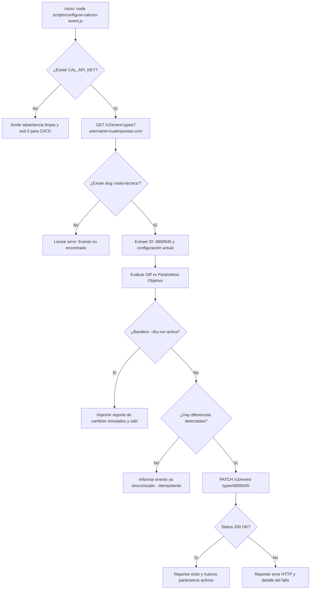

# Plan Técnico de Implementación: Spec 021 - Automatización y Blindaje de Parámetros Operativos en Cal.com
**Feature ID:** `021_calcom_booking_limits_automation`  
**Metodología:** Spec-Driven Development (SDD)  
**Estado:** DRAFT / UNDER REVIEW  

---

## 1. Arquitectura y Modelo de Integración con Cal.com API v2

La integración programática se fundamenta en la API v2 oficial de Cal.com (`https://api.cal.com/v2`), respaldada por la versión de esquema `2024-06-14`.

### Diagrama de Flujo del Script de Sincronización:


---

## 2. Contrato de la API y Mapeo de Parámetros

### Endpoint 1: Búsqueda del Event Type
* **Método:** `GET`
* **URL:** `https://api.cal.com/v2/event-types?username=cuatropuntas.com`
* **Headers:**
  * `Authorization: Bearer <CAL_API_KEY>`
  * `cal-api-version: 2024-06-14`
* **Respuesta esperada (200 OK):**
  * `data[].id`: `6800545`
  * `data[].slug`: `"visita-tecnica"`
  * `data[].minimumBookingNotice`: `120` (actual)
  * `data[].afterEventBuffer`: `90` (actual)
  * `data[].bookingWindow`: `{ "disabled": true }` (actual)

### Endpoint 2: Actualización de Parámetros Operativos
* **Método:** `PATCH`
* **URL:** `https://api.cal.com/v2/event-types/{eventTypeId}`
* **Headers:**
  * `Authorization: Bearer <CAL_API_KEY>`
  * `cal-api-version: 2024-06-14`
  * `Content-Type: application/json`
* **Payload Mandatorio:**
  ```json
  {
    "minimumBookingNotice": 1440,
    "beforeEventBuffer": 45,
    "afterEventBuffer": 45,
    "bookingWindow": {
      "type": "calendarDays",
      "value": 14,
      "rolling": true
    }
  }
  ```
* **Respuesta esperada (200 OK):**
  * `status`: `"success"`
  * `data.id`: `6800545`
  * `data.minimumBookingNotice`: `1440`
  * `data.beforeEventBuffer`: `45`
  * `data.afterEventBuffer`: `45`
  * `data.bookingWindow.type`: `"calendarDays"`
  * `data.bookingWindow.value`: `14`
  * `data.bookingWindow.rolling`: `true`

---

## 3. Diseño Modular de `scripts/configure-calcom-event.js`

Para garantizar testabilidad unitaria e integración sin mocks ciegos, el script se dividirá en funciones puras y reutilizables:

1. **`loadConfig(env)`:**
   - Detecta y valida `CAL_API_KEY`.
   - Lee banderas de CLI (`--dry-run`, `--event-slug=visita-tecnica`, `--username=cuatropuntas.com`).
   - Retorna objeto tipado de configuración.

2. **`buildEventPayload(options)`:**
   - Ensambla el payload normalizado para Cal.com v2 con los valores objetivo por defecto:
     * `minimumBookingNotice: 1440` (24 horas).
     * `beforeEventBuffer: 45` (45 minutos de amortiguación previa).
     * `afterEventBuffer: 45` (45 minutos de traslado posterior).
     * `bookingWindow: { type: "calendarDays", value: 14, rolling: true }` (14 días ventana rodante).

3. **`calculateDiff(currentEvent, targetPayload)`:**
   - Realiza una comparación campo a campo entre el estado remoto y los valores objetivo.
   - Retorna lista de cambios pendientes (`hasChanges: boolean`, `diffs: Array<{ field, from, to }>`).

4. **`syncCalcomEvent({ apiKey, slug, username, dryRun, fetchFn })`:**
   - Ejecuta la orquestación completa: consulta de lista, localización de ID, cálculo de diff, despacho de PATCH si no es dry-run, y reporte final.
   - Permite inyección de `fetchFn` para tests unitarios deterministas sin llamadas remotas accidentales.

---

## 4. Estrategia de Pruebas Automatizadas TDD (`tests/calcom-config.spec.js`)

Se diseñará una suite de pruebas rigurosa que cubra:
1. **Fase Roja Inicial:** Verificar que `scripts/configure-calcom-event.js` y `tests/calcom-config.spec.js` fallen ordenadamente antes de codificar la implementación.
2. **Validación de Parámetros:**
   - El payload generado debe contener exactamente `minimumBookingNotice: 1440`.
   - El payload generado debe contener `afterEventBuffer: 45`.
   - La ventana de reserva debe estructurarse con `type: 'calendarDays'`, `value: 14`, `rolling: false`.
3. **Manejo de Secretos:**
   - Verificación de que la API Key se extrae de variables de entorno y nunca se expone en logs de terminal.
   - Verificación de salida limpia (código 0) ante ausencia de `CAL_API_KEY`.
4. **Idempotencia y Simulación:**
   - Modo `--dry-run` debe emitir reporte de cambios sin ejecutar ningún `fetch` de tipo `PATCH`.
   - Si no hay diferencias entre el estado remoto y el objetivo, el script debe reportar estado sincronizado y no enviar peticiones innecesarias.
5. **Preservación Global:**
   - Ejecutar la suite completa (`npx playwright test`) y verificar 100% de tests en verde (122 preexistentes + nueva suite).
