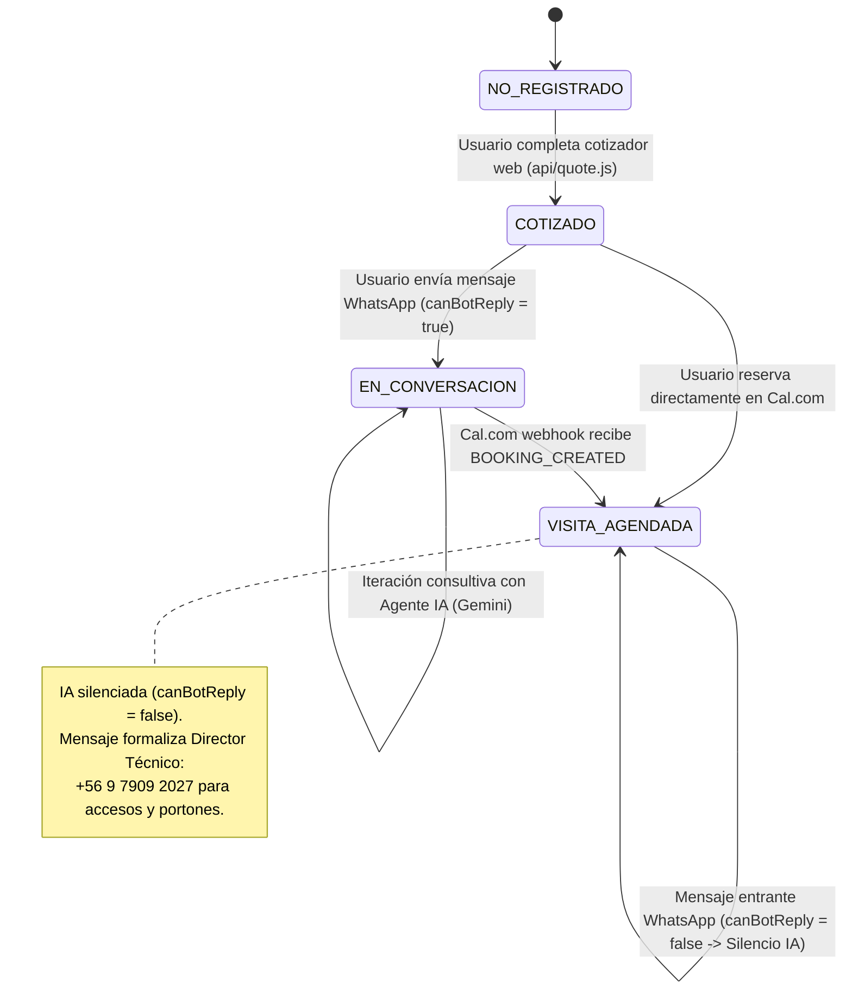
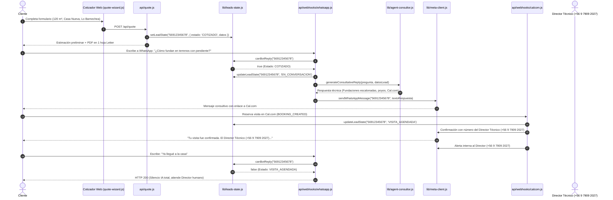

# Plan Técnico de Implementación: Spec 023 - Agente Asesor Consultivo y Orquestación de Estados

**Feature ID:** `023_conversational_advisor_agent`  
**Metodología:** Spec-Driven Development (SDD) / TDD  
**Estado:** COMPLETED  

---

## 1. Arquitectura del Sistema y Flujo de Estados

### 1.1. Diagrama de Transición de Estados del Lead


### 1.2. Diagrama de Secuencia: Ciclo Completo del Lead


---

## 2. Especificación de Módulos y Archivos

### 2.1. `lib/leads-state.js` (Gestor de Estados y Persistencia)
- **Estructura de Datos `LeadState`**:
  ```javascript
  {
    phone: "569XXXXXXXX",       // E.164 normalizado
    name: "Juan Pérez",
    email: "juan@ejemplo.com",
    estado: "COTIZADO",          // 'COTIZADO' | 'EN_CONVERSACION' | 'VISITA_AGENDADA'
    tipo: "Casa Nueva",
    area: 120,
    comuna: "Lo Barnechea",
    sistema: "Metalcom",
    minUF: 2280,
    maxUF: 2520,
    bookingDetails: null,
    createdAt: 1727218800000,
    updatedAt: 1727218800000
  }
  ```
- **Funciones Exportadas**:
  - `normalizePhone(rawPhone)`: Elimina símbolos y antepone prefijo `56` si es móvil de 9 dígitos.
  - `setLeadState(phone, data)`: Inicializa o sobrescribe el registro del lead.
  - `getLeadState(phone)`: Retorna el objeto `LeadState` o `null`.
  - `updateLeadState(phone, newState, patchData)`: Aplica transición y actualiza timestamp.
  - `findLeadByPhoneOrEmail(identifier)`: Busca indistintamente por teléfono o email (crucial para webhooks de Cal.com).
  - `canBotReply(phone)`: Retorna `true` si el estado es `COTIZADO` o `EN_CONVERSACION`; retorna `false` si es `VISITA_AGENDADA` o no existe.
  - `resetStateStore()`: Limpia el almacén en memoria (utilizado para aislar tests).

### 2.2. `lib/meta-client.js` (Cliente de WhatsApp y Mocking Automático)
- **Lógica de Conmutación**:
  - Si `process.env.WHATSAPP_TOKEN` no está definido o vale `'mock'` / `'test'`, conmuta a modo Mock sin emitir llamadas de red.
  - Registra llamadas en `sentMessagesHistory` para aserciones unitarias en tests.
- **Funciones Exportadas**:
  - `sendWhatsAppMessage(recipientNumber, textBody, incomingPhoneId)`: Despacha el mensaje a Meta Graph API v20.0 o al almacén Mock.
  - `getSentMessages()`: Retorna los mensajes enviados en el entorno de pruebas.
  - `clearSentMessages()`: Limpia el registro de mensajes de prueba.

### 2.3. `lib/agent-consultor.js` (Agente Asesor Consultivo con Gemini)
- **Modelo**: `gemini-1.5-flash` / `gemini-2.0-flash` vía `@google/generative-ai`.
- **System Instruction Especializada**:
  - Rol: Ingeniero Civil / Arquitecto Asesor de Cuatropuntas SpA.
  - Criterio de construcción chilena: Suelos de la RM, cálculo de radieres, pendientes y contención, soluciones acústicas en segundos pisos, transmitancia térmica según OGUC Zona 3 (techos $U \le 0.38$), permisos DOM y Ley 21.305.
  - Matriz de políticas comerciales: Contrato a suma alzada, Art. 18 LGUC, exclusiones de redes en quinchos base, tarifas fijas de recintos húmedos (baños 65-95 UF, cocinas 90-160 UF).
  - Contextualización: Invoca al cliente por su nombre y referencia los datos de su cotización previa.
  - Puente a Terreno: Cuando la consulta requiera análisis de cargas, estado de muros existentes o estudio topográfico, invita cordialmente a la visita técnica: `https://cal.com/cuatropuntas.com/visita-tecnica`.
  - Resiliencia / Fallback determinista: Si `GEMINI_API_KEY` no está configurada, genera una respuesta técnica contextualizada y estructurada para garantizar 100% de fiabilidad en tests.

### 2.4. `api/webhooks/whatsapp.js` (Webhook de Entrada de Meta)
- **GET**: Verificación de webhook con `hub.mode === 'subscribe'` y `hub.verify_token === WHATSAPP_VERIFY_TOKEN`.
- **POST**:
  1. Extrae `from`, `body` y `incomingPhoneId`.
  2. Evalúa `canBotReply(from)`.
  3. Si es `false`: Registra log y retorna HTTP 200 `EVENT_RECEIVED` (Silencio IA).
  4. Si es `true`:
     - Transiciona estado a `EN_CONVERSACION`.
     - Genera respuesta consultiva con `lib/agent-consultor.js`.
     - Envía mensaje vía `lib/meta-client.js`.
     - Retorna HTTP 200 `EVENT_RECEIVED`.

### 2.5. `api/webhooks/calcom.js` (Webhook de Confirmación de Cal.com)
- **POST**:
  1. Valida firma HMAC `x-cal-signature-256` si `CAL_WEBHOOK_SECRET` está configurado.
  2. Extrae `BOOKING_CREATED` / `booking.created`.
  3. Localiza al lead por teléfono o correo (`findLeadByPhoneOrEmail`).
  4. Transiciona estado a `VISITA_AGENDADA`.
  5. Despacha mensaje formal al cliente por WhatsApp:
     * Informa fecha, hora y tipología.
     * Entrega formalmente el contacto del Director Técnico: `+56 9 7909 2027` para coordinación en terreno.
  6. Despacha alerta interna al Director Técnico (`56979092027`).
  7. Retorna HTTP 200.

### 2.6. Integración en `api/quote.js`
- Al finalizar el flujo de cálculo exitoso (tras `sendMail`), invoca de forma no bloqueante:
  ```javascript
  setLeadState(formattedClientPhone, {
      name: nombre,
      email: email,
      tipo: tipo,
      areaNum: areaNum,
      comunaHuman: comunaHuman,
      sistema: sistema,
      minUF: minUF,
      maxUF: maxUF,
      permisos: permisosData?.adminBadge
  });
  ```

---

## 3. Estrategia de Pruebas y Resiliencia

1. **Nuevo Archivo de Pruebas:** `tests/conversational-advisor.spec.js`.
2. **Casos de Prueba TDD:**
   - **T01.1:** Ciclo de vida determinista en `lib/leads-state.js` (`COTIZADO` ➔ `EN_CONVERSACION` ➔ `VISITA_AGENDADA`).
   - **T01.2:** Evaluación de `canBotReply`: `false` para no registrados y visitas agendadas; `true` para cotizados y en conversación.
   - **T01.3:** Webhook Meta GET (Handshake) y POST con silencio IA ante lead con visita agendada.
   - **T01.4:** Webhook Meta POST con respuesta consultiva contextualizada para lead cotizado.
   - **T01.5:** Webhook Cal.com (`BOOKING_CREATED`): transición de estado y formalización de teléfono terminado en 2027 (`+56979092027`).
   - **T01.6:** Integración en `api/quote.js`: siembra automática del estado `COTIZADO`.
3. **Garantía Anti-Regresiones:** Ejecutar suite completa `npx playwright test` asegurando que los 129 tests preexistentes continúen en verde.
