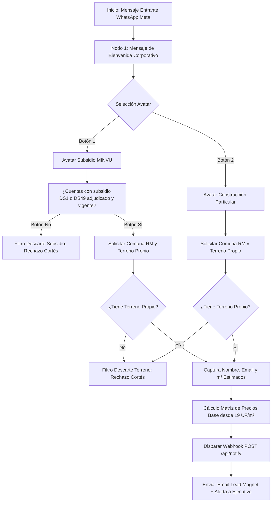

# BLUEPRINT DE META WHATSAPP BOT — FUNNEL DE FILTRADO HIGH TICKET CUATROPUNTAS

Este documento define la arquitectura conversacional, reglas de descarte automático y configuración de webhooks para el Bot Oficial de Meta WhatsApp de **Constructora Cuatropuntas SpA** (`+56979092027`).

---

## 1. PRINCIPIOS DIRECCIONADORES (Metodología Diego Abreu)
1. **Tolerancia cero al chateo eterno**: El bot no responde dudas vagas de postulación ni genera conversaciones pasivas. Cada interacción exige una respuesta de botón o entrada estructurada.
2. **Repeler proactivamente al no cualificado**: Si el cliente no posee subsidio adjudicado ni terreno propio (o busca que la constructora postule por él), es descartado inmediatamente con un mensaje de cierre respetuoso pero firme.
3. **Conversión rápida a Lead Caliente**: Solo los leads que cumplen factibilidad técnica (Terreno + Comuna RM + Subsidio Vigente o Presupuesto Privado >19 UF/m²) avanzan a captura de datos y reunión técnica humana.

---

## 2. FLUJO CONVERSACIONAL Y NODOS DE DECISIÓN



---

## 3. MENSAJES Y REGISTRO DE INTERACCIÓN (SCRIPTS EXACTOS)

### NODO 1: Bienvenida e Identificación de Avatar
> **Bot Meta**:
> "Bienvenido a **Constructora Cuatropuntas SpA**. 🏗️
> Para brindarte una atención técnica eficiente y validar la factibilidad de tu obra en la Región Metropolitana, por favor selecciona el tipo de proyecto:"
> 
> **Botones interactivos**:
> - `[1. Construcción con Subsidio MINVU]`
> - `[2. Construcción Particular/Privada]`

---

### RAMA 1: BENEFICIARIOS SUBSIDIO MINVU

#### Paso 1.1: Filtro Estricto de Adjudicación
> **Bot Meta**:
> "Excelente. Para poder asignarte un arquitecto patrocionante y equipo de construcción, requerimos validar el estado de tu beneficio estatal:
> 
> **¿Ya cuentas con tu subsidio DS1 (Tramo 2/3) o DS49 adjudicado y vigente con certificado oficial del MINVU?**"
> 
> **Botones interactivos**:
> - `[Sí, ya lo tengo adjudicado]`
> - `[No, estoy buscando postular]`

#### Paso 1.2A: Descarte Automático (Sin Subsidio Adjudicado)
> **Bot Meta**:
> "Gracias por comunicarte con Cuatropuntas. 
> 
> 🛑 **Información Importante**: En nuestra constructora **NO gestionamos postulaciones iniciales al MINVU** ni entregamos asesoría para obtener el subsidio por primera vez.
> 
> Una vez que postules y cuentes con tu certificado de subsidio adjudicado en mano, estaremos encantados de diseñar y construir tu vivienda en tu sitio propio. ¡Mucho éxito en tu proceso de postulación!"
> 
> *(Estado: Conversación finalizada / Session Closed)*

#### Paso 1.2B: Calificación Técnica (Con Subsidio Adjudicado)
> **Bot Meta**:
> "¡Felicitaciones por la adjudicación de tu subsidio! 🎉
> 
> Para confirmar la factibilidad territorial de la obra, por favor responde:
> 1. **¿En qué comuna de la Región Metropolitana o alrededores se ubica el proyecto?**
> 2. **¿El terreno o sitio propio está a tu nombre o de un familiar directo con dominio inscrito en el CBR?**"
> 
> **Botones interactivos**:
> - `[Sí, tengo terreno propio]`
> - `[No tengo terreno aún]`

---

### RAMA 2: CLIENTES PARTICULARES / PRIVADOS

#### Paso 2.1: Filtro de Terreno y Localización
> **Bot Meta**:
> "Excelente. En Cuatropuntas desarrollamos proyectos de casas nuevas, segundos pisos y remodelaciones desde **19 UF/m² (llave en mano)** en Metalcom, SIP y Albañilería.
> 
> Para evaluar la factibilidad de tu proyecto, indícanos:
> 1. **¿En qué comuna de la RM se construirá la obra?**
> 2. **¿Cuentas con terreno o propiedad habilitada para construir?**"
> 
> **Botones interactivos**:
> - `[Sí, cuento con terreno/propiedad]`
> - `[No tengo terreno/propiedad]`

#### Paso 2.2: Descarte Automático (Sin Terreno Propio)
> **Bot Meta**:
> "Gracias por tu interés en Cuatropuntas.
> 
> 🛑 **Información Importante**: Actualmente requerimos que el cliente posea el terreno o propiedad previamente adquirida e inscrita para ejecutar el proyecto de ingeniería y construcción. 
> 
> Te invitamos a recontactarnos tan pronto dispongas del sitio o propiedad habilitada. ¡Te deseamos el mayor de los éxitos!"
> 
> *(Estado: Conversación finalizada / Session Closed)*

---

### NODO FINAL: CAPTURA DE DATOS Y GATILLO DE WEBHOOK (LEAD CALIENTE)

Cuando el prospecto aprueba los filtros (Subsidio Vigente o Particular + Terreno Propio + Comuna RM):

> **Bot Meta**:
> "¡Perfecto! Tu proyecto cumple con los criterios de factibilidad técnica inicial. 🚀
> 
> Para preparar tu ficha técnica y enviarte nuestra **Guía Exclusiva de Construcción Llave en Mano + Presupuesto Estimado**, por favor escríbenos:
> 1. **Tu Nombre Completo**
> 2. **Tu Correo Electrónico**
> 3. **Metros cuadrados aproximados a construir (ej: 80 m²)**"

---

## 4. INTEGRACIÓN WEBHOOK META WATSAPP (`/api/notify`)

Al recibir los 3 datos, el Bot de Meta despacha una solicitud `POST` al endpoint seguro de Vercel:

```json
{
  "lead_type": "Subsidio DS1/DS49" | "Particular Privado",
  "nombre": "Nombre del Cliente",
  "email": "cliente@correo.com",
  "telefono": "+569XXXXXXXX",
  "comuna": "Comuna RM",
  "terreno_propio": "Sí",
  "subsidio_adjudicado": "Sí",
  "area_estimada": 80,
  "sistema_preferido": "Metalcom / SIP / Albañilería",
  "lead_magnet_url": "https://cuatropuntas.com/video-recurso-educativo"
}
```

El endpoint `/api/notify`:
1. Envía un correo automático desde `contacto@cuatropuntas.com` al cliente dándole la bienvenida y adjuntando el **Lead Magnet en Video**.
2. Envía una alerta de alta prioridad a la bandeja ejecutiva con los datos listos para el agendamiento humano de la visita técnica.
